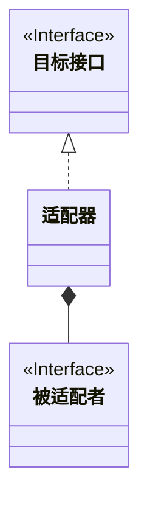

w> 单例模式：确保一个类只有一个实例，并提供全局访问点

同步方式处理-性能低

```java
public class Singleton {
    private static Singleton instance;
    private Singleton() {
    }
    public static synchronized Singleton getInstance() {
        if (instance == null) {
            instance = new Singleton();
        }
        return instance;
    }
}
```

非延迟初始化

```java
public class Singleton {
    private static Singleton instance = new Singleton();
    private Singleton() {
    }
    public static  Singleton getInstance() {
        return instance;
    }
}
```

双重检查加锁

```java
public class Singleton {
    private volatile static Singleton instance;

    private Singleton() {
    }

    public static Singleton getInstance() {
        if (instance == null) {
            synchronized (Singleton.class) {
                if (instance == null) {
                    instance = new Singleton();
                }
            }
        }
        return instance;
    }
}
```

> 命令模式
>
> 发出请求的对象和接受和执行这些请求的对象分隔开
>
> 将“请求”封装为对象，以便使用不同的请求或队列或日志来参数化其他操作

###### 适配器模式

> 将一个类的接口转为另一个接口；让原本接口不兼容的类可以相互合作。
>
> 适配器分为类适配器和对象适配器
>
> 类适配器:需要继承多个类;Java中不支持多继承
>
> 对象适配器:使用组合的方式
>
> 适配器模式将一个或多个接口变成期望的接口
>
> 使用时机:当使用一个类时，其接口不符合需要




###### 外观模式

>提供子系统的简化接口
>
>提供同一接口，用来访问子系统中的一群接口。外观定义了一层接口，让子系统更容易使用

###### 模版方法模式

> 在一个方法中定义了一个算法的骨架，而将一些步骤延迟到子类中。模版方法使得子类可以在不改变算法结构的情况下，重新定义算法中的某些步骤

###### 迭代器模式

> 提供一种方法顺序访问一个聚合对象中的各个元素，而又不暴露内部的表示。
